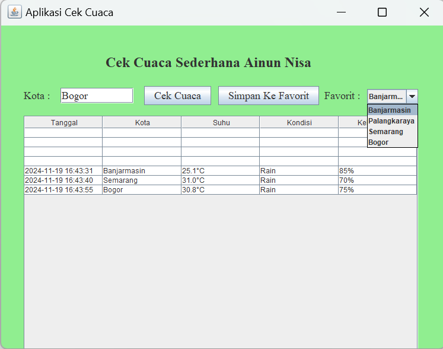

# AplikasiCekCuacaSederhana
 Tugas 6 - Ainun Nisa - 2210010099

# Aplikasi Cek Cuaca Sederhana
Aplikasi Cek Cuaca Sederhana adalah aplikasi untuk mengecek cuaca secara real time menggunakan key api openweathermap

# Keunggulan Aplikasi
Cek Cuaca Sederhana: Aplikasi ini terdapat tanggal, kota, suhu, kondisi dan kelembaban

# Pembuat Aplikasi
Ainun Nisa - 2210010099 - Tugas 6

# Fitur
Aplikasi ini menawarkan fitur:
Cek cuaca sederhana

# Cara Menjalankan
Run File
Ketikkan Kota yang ingin diinput
Tekan Button Cek cuaca, maka akan keluar hasil
Tekan Button Simpan ke favorit, maka kota yang diinput akan tersimpan

# Demo
